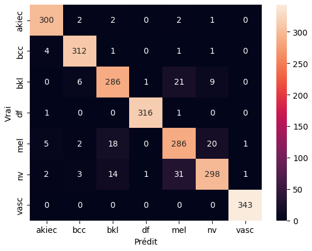

# Classification des grains de beauté

Cette application permet de classifier une image de peau en tumeur **bénigne** ou **maligne** en 7 classes :


à partir d’un modèle entraîné Densenet121 256px, avec une interface web simple et interactive.

La précision du modèle est d'environ 93%.

Rapport de classification avec jeu de données augmenté


Rapport de classification sur jeu de validation originel 10%


Matrice de confusion avec jeu de données augmenté



Matrice de confusion sur jeux de validation 10% originel en pourcentage


## Fonctionnalités

- Upload d’une image en mémoire, sans stockage disque
- Prédiction probabiliste avec affichage des pourcentages pour chaque classe
- Barre graphique colorée : vert pour bénin, rouge pour malin
- Modèle téléchargé automatiquement depuis Google Drive
- Conteneur Docker prêt à déployer
- Déploiement facile sur Google Cloud Run via Cloud Build

## Structure du projet

```
├── Dockerfile
├── main.py
├── requirements.txt
├── templates/
│ └── index.html
├── model/ # dossier créé au runtime, fichiers téléchargés automatiquement
│ ├── skin_classifier.pt
└── cloudbuild.yaml # script de build et déploiement GCP Cloud Run
```

## Construire et runner l’image Docker

```sh
docker build -t skin-prediction .

docker run -p 5000:5000 skin-prediction
```

## Accès 

http://localhost:5000
